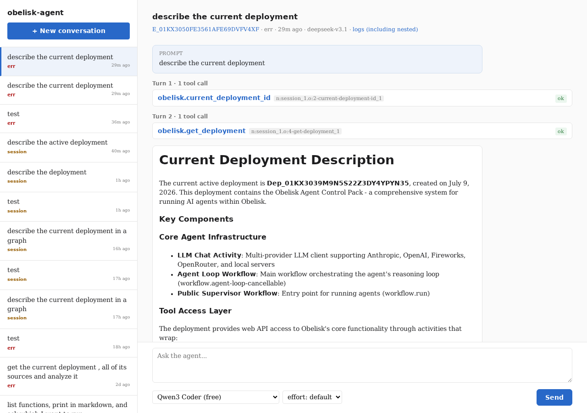

# workflow-agent

> [!WARNING]
> **Vibe coded**: This codebase was generated using an agent (partially by workflow-agent itself), testing the limits of this approach.

An Obelisk app in which **the workflow is the agent**. It holds a
provider-neutral chat history, drives an LLM over one of three wire APIs
(**Anthropic Messages**, **OpenAI Chat Completions**, **OpenAI Responses**),
dispatches the model's tool calls to real Obelisk activities, and feeds the
results back, all as durable, replayable workflow state.

The core (agent loop + LLM router + web UI) is generic; a runtime **pack**
supplies the use case (system prompt + tools). This repo ships one pack,
`obelisk-control`, which inspects and modifies the Obelisk instance it runs on.



## Requirements

- **Obelisk** — the runtime that serves this deployment. Use `nix develop` for
  the pinned toolchain.
- **`AGENT_MODELS`** — the model catalog, **required**: a JSON array pointing each
  model at an OpenAI- or Anthropic-shaped HTTP endpoint. Two ready-made catalogs
  ship:
  - `models.local.json` — the sibling
    [`agent-backed-llm-server`](https://github.com/obeli-sk/agent-backed-llm-server)
    (a Claude/Codex subscription in docker, keyless on `:9190`).
  - `models.exe-gateway.json` — the exe.dev LLM gateway (Anthropic + OpenAI +
    Fireworks). Requires an exe.dev account; the entries point at
    `http://localhost:7070`, so forward the gateway to that local port first:
    ```sh
    ssh -L 7070:169.254.169.254:80 <yourinstance>.exe.xyz
    ```
  - `models.openrouter.json` — [OpenRouter](https://openrouter.ai) (Claude, GPT,
    DeepSeek, and a free Qwen3 Coder model). Needs an API key; the key stays
    secret (injected into the outbound header at the edge, never seen by the JS):
    ```sh
    export OPENROUTER_API_KEY=sk-or-...
    ```

  Any other compatible endpoint (Anthropic/OpenAI directly, vLLM, Ollama, …)
  works too — add an entry pointing at it.

## Run

Set the required catalog, then serve:

```sh
ln -sf models.local.json models.json      # pick a catalog
export AGENT_MODELS="$(cat models.json)"   # or use direnv (.envrc-example)
just serve                                 # obelisk server run -d deployment.toml
```

Then open the web UI on the webhook port (default `8080`), or submit via the API:

```sh
curl -X POST http://127.0.0.1:8080/api/submit \
  -H content-type:application/json -d '{"prompt":"Summarise recent executions.","backend":"claude"}'
```

`backend` is the model `id` from the catalog (empty selects the first entry).
Each turn is a separate `llm.completion` activity and each tool call its own
child execution, so a run is fully durable and replayable; inspect it with the
web UI or the standard Obelisk WebAPI / CLI.
