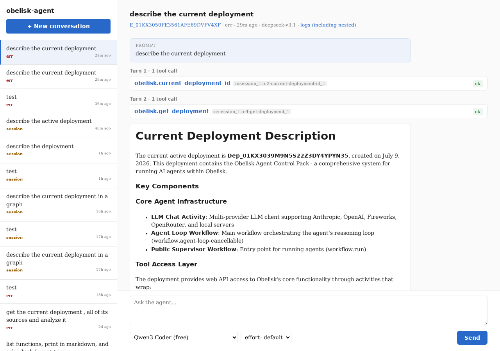

# workflow-agent

> [!WARNING]
> **Vibe coded**: This codebase was generated using an agent (partially by workflow-agent itself), testing the limits of this approach.

An Obelisk app in which **the workflow is the agent**. It holds a
provider-neutral chat history, a persistent just-bash virtual filesystem, and
one model-facing `bash` tool. Pack executables run inside the same workflow and
call real Obelisk activities for external operations.

The core owns the agent loop, Bash session, LLM router, and web UI. A compiled
**pack** supplies commands, system guidance, and virtual files. This repo ships
one pack, `obelisk-control`, which mounts the active deployment under
`/workspace/deployment` and provides an `obelisk` executable. The mount is lazy:
the file tree (including each component's `backtrace.sources`) lists
immediately, and bounded file bodies are fetched from the content-addressed
store the first time they are read. The mount carries each file's digest and
byte size, so metadata commands do not fetch content. Files larger than 1 MiB
remain digest-only and read as a short type, digest, and size placeholder (see
`meta/designs/workflow-agent-lazy-deployment-mount.md`). Because the requested
body was not read, `cat` returns a nonzero status after printing the placeholder.
`sha256sum` uses a mounted file's stored digest without fetching its body, and
computes a new digest after the file is modified locally.



## Requirements

- **Obelisk**: the runtime that serves this deployment (pinned via the flake, so
  `nix develop` provides the matching binary).
- **Rust (wasm32-unknown-unknown)**: the workflow is a native Rust component
  (`workflow/workflow-rs`) built with the toolchain the flake pins. `just build`
  compiles it. The shell it runs is a Rust port of just-bash, vendored at
  `vendor/just-bash-rs` (Apache-2.0, see its LICENSE/NOTICE).
- **LLM endpoint**: one endpoint serves the whole catalog, configured by three
  env vars set together: `AGENT_MODELS` (the catalog JSON, **required**),
  `LLM_BASE_URL` (the endpoint origin, default `http://127.0.0.1:9190`), and
  `LLM_API_KEY` (the bearer token; unset for a keyless endpoint). Each catalog
  entry points a model at an OpenAI- or Anthropic-shaped route under that origin.
  Three ready-made catalogs ship:
  - `models.local.json` (`LLM_BASE_URL=http://127.0.0.1:9190`, keyless): the
    sibling [`agent-backed-llm-server`](https://github.com/obeli-sk/agent-backed-llm-server)
    (a Claude/Codex subscription in docker on `:9190`).
  - `models.exe-gateway.json` (`LLM_BASE_URL=http://localhost:7070` + `LLM_API_KEY`):
    the exe.dev LLM gateway (Anthropic + OpenAI + Fireworks). Requires an exe.dev
    account; forward the gateway to that local port first:
    ```sh
    ssh -L 7070:169.254.169.254:80 <yourinstance>.exe.xyz
    ```
  - `models.openrouter.json` (`LLM_BASE_URL=https://openrouter.ai/api` +
    `LLM_API_KEY`): [OpenRouter](https://openrouter.ai) (Claude, GPT, DeepSeek,
    and a free Qwen3 Coder model). The key stays secret, injected into the
    outbound header at the edge and never seen by the JS.

  Any other compatible endpoint (Anthropic/OpenAI directly, vLLM, Ollama, …)
  works too: point `LLM_BASE_URL` at it and add catalog entries (with a `path`
  prefix if the endpoint fronts several providers).

## Run

Build the workflow component and set the required catalog + endpoint:

```sh
just build
ln -sf models.local.json models.json      # pick a catalog
export AGENT_MODELS="$(cat models.json)"   # or use direnv (.envrc-example)
export LLM_BASE_URL=http://127.0.0.1:9190  # match the catalog's endpoint
```

`just serve` starts the app (it runs `obelisk server run -d deployment.toml`
with the Obelisk the flake pins). The workflow is a native Rust component, so no
special Obelisk build is required.

Then navigate to http://localhost:9090. Create an empty session to use the shell
directly, or submit a prompt and inspect the same filesystem afterward. The
operator input offer remains live while an LLM completion is pending, so shell
commands can inspect and edit the session VFS during the model wait. A prompt
sent during that wait is queued for the next model turn. Each direct shell
command is also a conversation turn: its Bash tool request and structured
result are included in the agent's next completion request after a later
operator message starts the agent.

## Try the stateless MCP sample

The dependency-free sample server exposes tools, a prompt, and two resources.
In one terminal, start it with `just sample-mcp-server`. Then uncomment the
`mcp_obelisk_local` activity at the bottom of `deployment.toml` and the keyless
outbound host block at the bottom of `server.toml` (leave the secret lines
commented), build, and run the app normally.

Create a new empty session after deploying, then run:

```sh
mcp list
obelisk-local --help
obelisk-local info
obelisk-local tools
obelisk-local tools add --help
obelisk-local tools add --a 2 --b 3
obelisk-local prompts
obelisk-local prompt greeting --help
obelisk-local prompt greeting --name world
find /workspace/mcp/obelisk-local -type f
cat /workspace/mcp/obelisk-local/README.md
cat /workspace/mcp/obelisk-local/config/settings.json
```

Resources are listed when the session mounts the server and fetched through
`resources/read` only when a command first reads their VFS path.

The core registers a broad shell command catalog ported from just-bash, except
`gzip`, `gunzip`, and `zcat`. This includes the standard file, path,
text-processing, search, shell, checksum, encoding, and inspection tools. Run
`help` to list built-ins and dynamically discovered programs, or `which NAME`
to check one name.

External programs use one process-like Obelisk interface. At session startup,
the workflow discovers exports under `obelisk-agent:programs/program.*` whose
WIT is `func(stdin: string, args: list<string>) -> result<record { stdout:
string, stderr: string, exit-code: u32 }, string>`, then registers each
function name as a Bash command. The outer result is required for Obelisk
activities and is unwrapped before the record reaches Bash. The first program
is a GET-only `curl`. The command has no embedded host policy; its durable
activity is currently limited to `https://obeli.sk` by the deployment host
allowlist. Python, Node.js, tar, yq, xan, and SQLite require runtimes that the
workflow sandbox does not provide.

Interactive job control is not available. `jobs`, `wait`, `fg`, `bg`, signals,
and durable background execution with `&` are not supported. The session
rejects statements terminated by `&` instead of silently running them in the
foreground. Packs use Obelisk child executions for durable external work.

If an empty session finishes immediately, inspect its execution result and
logs.
